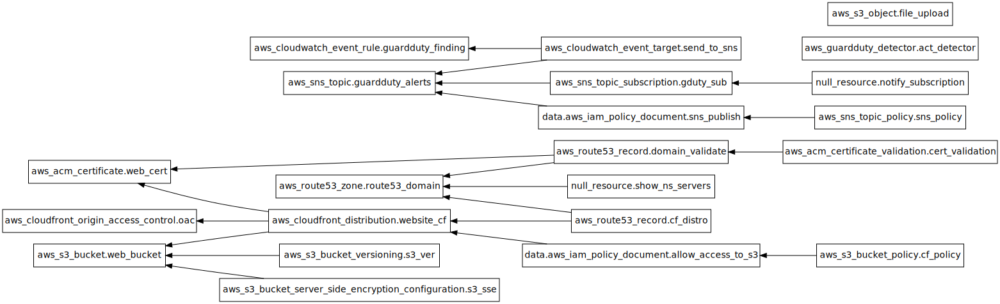

About
--
This repository is used to create a full AWS static web stack using terraform. Typical costs run around $1.00USD/mo (depending on usage) when using this stack.

It Deploys a suite of AWS Services to provide you a secure hosting environment. These services include:
* **Route53** (for DNS hosting of your domain)
* **S3** (with no public access thanks to OAC - Origin Access Control and IAM Policies)
* **ACM** (for encryption in-transit to viewers)
* **Cloudfront** (which includes network level DDOS protection w/ AWS Shield and TLS 1.2 requirements)
* **GuardDuty** (to secure your AWS account from unusual backend access attempts)
* **SNS** (to alert you via email - should GuardDuty see something unusual)

Assumptions
--
* You have a folder of static files (HTML, CSS, JavaScript...) that you want to host with unlimited scale for viewers at barely any cost with _little_ to worry about from a security standpoint.
* You own a domain that you want to host the content on. **NOTE** If this domain is currently in-use with a different hosting provider, you'll obviously want to make sure that you modify the s3_upload block to get your web content in there. You may also need to add additional DNS entries into Route53 through the route53.tf file.
  * It is possible to go through the domain registration itself with Route53. This script doesn't currently do that. Maintaining some separation between the registrar and server environment has security benefits. If you have a need to dynamically register domains, you certainly could modify this stack to do so though.
* You are comfortable following technical directions and know some git basics.

Prep Work
--
More docs are coming, but at a high-level you will need to perform the following with ClickOps (via the graphical console) BEFORE running this stack:
* (Suggested) Create a fresh AWS Sub-Account via AWS Organizations
* (Suggested) Create and apply the provided IAM Role policy to your admin user in your root account (see the reference/ folder)
* (Suggested) Switch roles to the new account
* (Suggested) Create a new IAM admin user in that account
* Login to the IAM admin user
* Create an S3 Bucket for Terraform State named YOUR_DOMAIN-terraform
* Apply the S3 Bucket Policy provided (see the reference/ folder)

At that point you are ready to either:
1. Clone this repository to your development host, and create your local environment files. These files are installation specific, but there are examples available in the reference folder:
* terraform.tfvars
* tf-s3static_hardened-init.sh (this will build the necessary backend.conf and call it)
* (Optional) tf-s3static_hardened-plan.sh
* (Optional) tf-s3static_hardened-apply.sh
* (Optional) Some content to host - You can change the s3.tf file "s3_upload" block to fit your needs. This is where a simple test index.html file gets uploaded. 

If you don't want to create the tf-static_hardened-apply.sh (or plan), you will still need your environment variables to contain AWS_REGION at a minimum. It is assumed that you have already gone through and configured AWS credentials with `aws configure`

**OR**

2. (Advanced) Use GitHub Actions (or another CI/CD pipeline). An example GitHub Action file is available here: [plan-template](./reference/EXAMPLE-github_actions-terraform-plan.yml) and [apply-template](./reference/EXAMPLE-github_actions-terraform-apply.yml)

If you use GitHub Actions, you don't need a host to deploy your infrastructure at all. There are _many_ ways to do this, but one fairly simple one follows...: 
* Mirror this repository into an empty **private** one that you control
* Add your AWS_ACCESS_KEY_ID and AWS_SECRET_ACCESS_KEY into GitHub -> Settings -> Secrets and Variables -> Actions -> Repository secrets
* Create a new file in your mirrored repository .github/workflows/terraform-plan.yml and populate it from the plan-template referenced above
* Make another file .github/workflows/terraform-action.yml and populate it from the action-template referenced above
* Modify the domains in these files to match your needs (and commit these changed files)
* You should now be able to navigate to Actions in your GitHub repository and trigger the plan or apply actions (and monitor their progress) from GitHub

You _can_ modify the GitHub templates to trigger on commit obviously (the main point to CI/CD), but I will leave that to you. Tread carefully. 

Post-Setup
--
Once your domain is up and running, you'll obviously need to work on a way to update the content. This can be done with a simple script that does an S3 sync up to your bucket. 

Something to bear in mind... While you can create a ```terraform destroy``` workflow or shell script, This _will_ fail unless you manually clear the S3 bucket contents prior to doing so. This can technically be forced with Terraform, but I've deliberately avoided doing that for safety reasons.

Once you have your upload workflow working, you might want to consider removing any * level (administrator) access API keys used to set this up. You could also use the IAM policy advisor to lock it down, but 0 access is even better (if you don't need it). 

Features that are coming soon:
--
* DNSSEC
* Role-based IAM options (to avoid having ANY IAM accounts in your web hosting console)
* CloudTrail / CloudWatch / SNS notifications for certain security events
* Conversion to a module
* Example S3 Sync scripts
* Docs on how to Issue an Invalidation to CloudFront via ClickOps (Web Interface) or CLI

Graph of Resources
--

